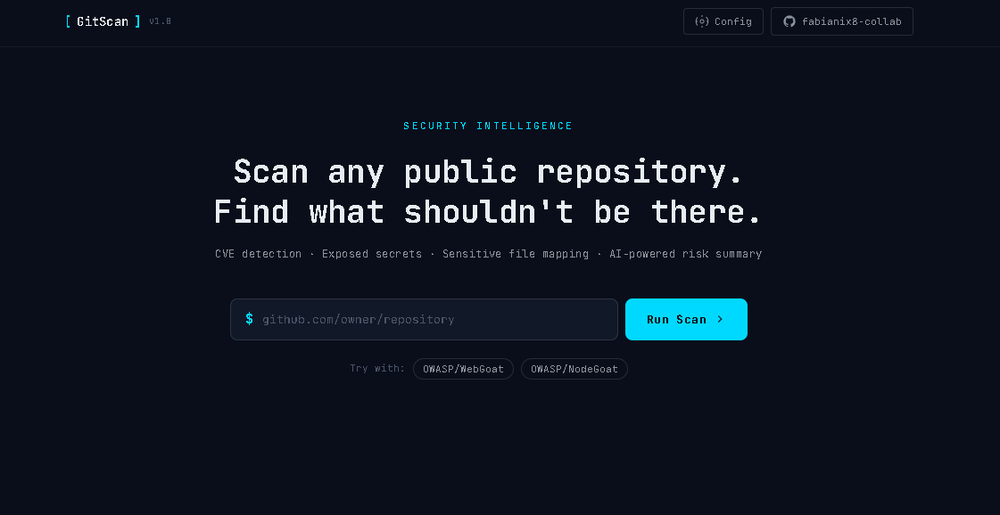
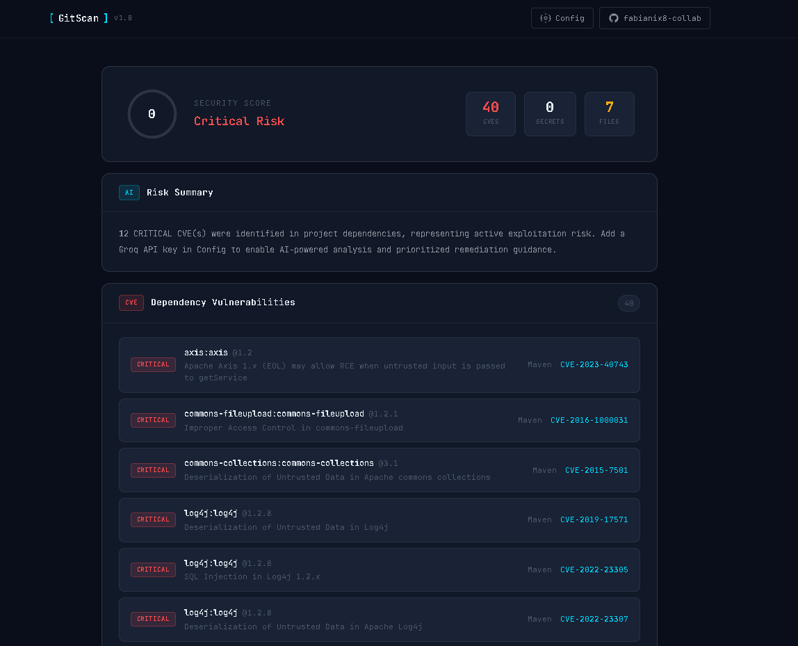
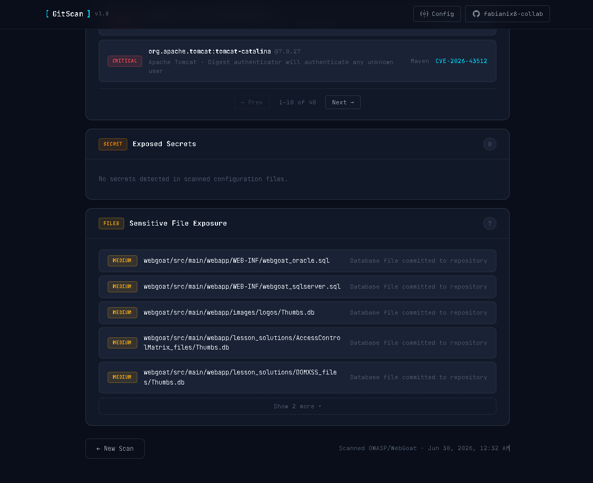

# [GitScan](https://fabianix8-collab.github.io/gitscan/)

AI-powered security analyzer for public GitHub repositories.

Paste a repo URL → get a security report covering vulnerable dependencies, exposed secrets, and sensitive files — in seconds, entirely client-side.


---

## Live example

Scanning [OWASP/WebGoat](https://github.com/OWASP/WebGoat) — a deliberately vulnerable Java application used for security training — surfaces 40 dependency CVEs (12 of them CRITICAL, including known RCE and deserialization vulnerabilities in `log4j`, `axis`, and `tomcat-catalina`) and 7 exposed database files committed to the repository. Every finding links to its CVE or GHSA advisory.

<table>
  <tr>
    <td></td>
    <td></td>
  </tr>
  <tr>
    <td align="center"><sub>Terminal-style landing page — paste a repo URL or try a known-vulnerable demo repo</sub></td>
    <td align="center"><sub>Security score, AI risk summary, and CVE findings with real CVE IDs and severities</sub></td>
  </tr>
</table>


<p align="center"><sub>Paginated CVE table (10 per page) and collapsible sensitive file list — no infinite scroll, even on a 40-finding scan</sub></p>

## What it detects

| Category | Method |
|---|---|
| **Dependency CVEs** | OSV.dev — batch query + per-vulnerability detail fetch across npm, PyPI, Go, Maven, RubyGems, Cargo, Packagist |
| **Exposed secrets** | 22 regex rules + Shannon entropy filtering to suppress false positives |
| **Sensitive files** | 40+ path patterns matched against the full repository file tree |
| **Risk summary** | Groq (Llama 3) generates an executive-level analysis from the consolidated findings |

## Architecture & design decisions

This section exists because the choices below are deliberate trade-offs, not limitations.

**No backend, by design.** GitScan runs entirely in the browser and talks directly to GitHub, OSV.dev, and Groq. There is no server to compromise, no API proxy to go down, and no infrastructure cost. For a static security tool, this is the correct shape — not a missing feature.

**Bring-your-own-key (BYOK), not a shared backend key.** GitHub and Groq credentials are entered by the user and stored only in their browser's `localStorage` — never transmitted anywhere except the respective API. This is the same model used by Snyk's CLI, GitHub's own CLI tools, and most serious open-source security scanners: a tool that asks for your credentials to act on your behalf, rather than embedding a shared key that any anonymous visitor could exhaust or abuse. Embedding a personal API key in client-side code shipped to the public would be a real vulnerability in a security tool — the irony would not be lost on anyone reviewing the code.

**Why OSV.dev needs two API calls per scan, not one.** The `/v1/querybatch` endpoint is fast but intentionally minimal — it returns only vulnerability IDs, not severity or descriptions. GitScan resolves the IDs in one batch call, then fetches full details (`/v1/vulns/{id}`) for each unique vulnerability found, with bounded concurrency to stay respectful of a free public API. This was discovered during testing, not assumed from documentation: the initial implementation surfaced every finding as `UNKNOWN` severity, which led to inspecting the actual API response shape rather than trusting the schema on paper.

**No AI key required for the core scan.** CVE detection, secret scanning, and sensitive file mapping work immediately with zero configuration. The Groq key only unlocks the AI-generated risk summary; without it, GitScan falls back to a rule-based summary built from the same findings — degraded, not broken.

## Stack

- **Vanilla JS (ES6 modules)** — no build step, no framework overhead, nothing to compile
- **GitHub REST API** — file tree traversal and selective content fetching (no full-repo downloads)
- **OSV.dev** — open-source CVE database, free, no auth required
- **Groq** — LLM inference (Llama 3 8B), bring your own key
- **GitHub Pages + Actions** — static hosting with CI/CD on every push to `main`

## Running locally

```bash
git clone https://github.com/fabianix8-collab/gitscan.git
cd gitscan

# ES modules require an HTTP server, not file://
npx serve .
# or
python3 -m http.server 8080
```

Then open `http://localhost:8080`.

## Configuration

Click **Config** in the top-right corner to set your API keys.

| Key | Required | Purpose |
|---|---|---|
| GitHub PAT | Optional | Raises the rate limit from 60 to 5,000 req/hr — recommended for repeated scans |
| Groq API Key | Optional | Enables the AI-generated risk summary |

[Generate a GitHub token →](https://github.com/settings/tokens/new?scopes=public_repo&description=GitScan)
[Get a free Groq key →](https://console.groq.com/keys)

## Project structure

```
gitscan/
├── index.html
├── css/
│   └── main.css
├── js/
│   ├── main.js           # Orchestrator — UI state + scan pipeline
│   ├── github.js         # GitHub API client
│   ├── osv.js            # OSV.dev batch query + detail resolution
│   ├── groq.js           # Groq AI analysis + rule-based fallback
│   ├── report.js         # DOM renderer, score calculator, pagination
│   └── scanner/
│       ├── deps.js       # Dependency manifest parser (8 formats)
│       ├── secrets.js    # Regex + entropy secret detection
│       └── sensitive.js  # Sensitive file path detection
└── .github/workflows/
    └── deploy.yml        # Auto-deploy to GitHub Pages on push
```

## Roadmap

- [ ] SAST: pattern-based detection of insecure code (hardcoded IPs, dangerous function calls, SQLi vectors)
- [ ] PDF export of the security report
- [ ] Historical scan comparison
- [ ] Shareable badge generation for repositories

---

Built by [Fabian](https://github.com/fabianix8-collab) · Part of a cybersecurity portfolio targeting the Chilean market
